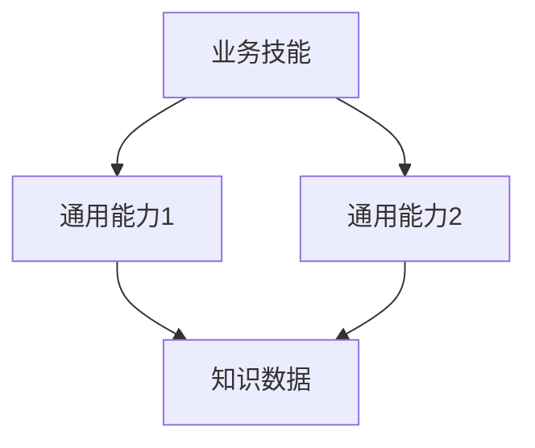

# 📋 OpenClaw 业务驱动训练计划模板

| 项目         | 内容                          |
| ---------- | --------------------------- |
| **计划名称**   |                             |
| **核心业务目标** | （一句话概括：实现 XXX 业务流程自动化/能力增强） |
| **计划版本**   | v1.0                        |
| **制定日期**   | 2026-XX-XX                  |
| **负责人**    |                             |
| **预计总工时**  | XX 小时                       |
| **覆盖技能数**  | XX 个                        |

---

## 🎯 一、业务目标总览

### 1.1 业务背景与痛点
（描述当前业务痛点，为什么要做这个训练）
- 痛点1：
- 痛点2：
- 痛点3：

### 1.2 业务价值与收益
（量化说明训练完成后能带来的业务价值）
- 效率提升：XX%
- 人工干预减少：XX%
- 准确率提升：XX%
- 其他收益：

### 1.3 成功标准
（可量化、可验证的成功判定指标）
- [ ] 指标1：
- [ ] 指标2：
- [ ] 指标3：

---

## 🏗️ 二、三层架构任务映射总表

| 架构层级 | 任务编号 | 任务名称 | 业务价值 | 优先级 | 预计耗时 | 依赖 |
|---------|---------|---------|---------|-------|---------|------|
| **📊 业务技能层** | | | | | | |
| | | | | | | |
| | | | | | | |
| **🔧 通用能力层** | | | | | | |
| | | | | | | |
| | | | | | | |
| **📜 知识数据层** | | | | | | |
| | | | | | | |

---

## 📋 三、分阶段任务规划

### 🔴 P0 第一阶段：核心价值交付（MVP）

| 任务编号 | 任务名称 | 负责Agent | 业务目标 | 预计耗时 | 前置依赖 |
|---------|---------|----------|---------|---------|---------|
| | | | | | |
| | | | | | |

**P0 阶段交付成果**：
1.
2.
3.

---

### 🟡 P1 第二阶段：能力强化与闭环

| 任务编号 | 任务名称 | 负责Agent | 业务目标 | 预计耗时 | 前置依赖 |
|---------|---------|----------|---------|---------|---------|
| | | | | | |

**P1 阶段交付成果**：
1.
2.
3.

---

### ⚪ P2 第三阶段：体系化与优化

| 任务编号 | 任务名称 | 负责Agent | 业务目标 | 预计耗时 | 前置依赖 |
|---------|---------|----------|---------|---------|---------|
| | | | | | |

**P2 阶段交付成果**：
1.
2.
3.

---

## 📝 四、单个任务详细设计模板

（复制此节为每个任务填写详细设计）

---

### 任务编号：P0-01

### 任务名称：

### 业务目标：
（为什么要做这个任务，解决什么业务问题）

### 三层架构设计：

| 层级 | 说明 |
|------|------|
| 📊 **业务技能层** |（业务逻辑放在哪里，新增/修改哪个技能）|
| 🔧 **通用能力层** |（调用/增强哪些通用引擎）|
| 📜 **知识数据层** |（需要什么知识数据支撑）|

### 核心调用关系：

### 功能需求：
1.
2.
3.

### 验收标准：
- [ ] 标准1：
- [ ] 标准2：
- [ ] 标准3：

### 输出交付物：
1. 代码/配置：
2. 文档：
3. 测试报告：

### 风险与注意事项：
1.
2.

---

## ⚠️ 五、风险与依赖管理

### 5.1 外部依赖
| 依赖项 | 依赖类型 | 影响范围 | 风险等级 | 应对方案 |
|--------|---------|---------|---------|---------|
| | | | | |

### 5.2 技术风险
| 风险 | 影响 | 概率 | 应对方案 |
|------|------|------|---------|
| | | | |

### 5.3 业务风险
| 风险 | 影响 | 概率 | 应对方案 |
|------|------|------|---------|
| | | | |

---

## ✅ 六、验收标准总览

### 6.1 通用验收要求（所有技能必须满足）
- [ ] 所有密码/凭证通过 Keychain 存储，无明文硬编码
- [ ] 完整的 SKILL 文档（触发条件、安全规则、使用说明）
- [ ] 完整的 DEPENDENCIES.md（依赖清单+安装命令）
- [ ] 可重复运行的脚本（无绝对路径硬编码）
- [ ] 错误处理与重试机制
- [ ] 配置驱动（规则外置YAML，不硬编码）
- [ ] 日志输出规范

### 6.2 业务验收标准
| 验收项 | 验收标准 | 验证方式 |
|--------|---------|---------|
| | | |
| | | |

### 6.3 架构验收标准
| 验收项 | 验收标准 |
|--------|---------|
| 三层解耦 | 业务逻辑不混入通用层、知识层 |
| 能力复用 | 新增能力优先复用现有通用/知识层 |
| 接口标准化 | 跨技能调用接口统一 |
| 可测试性 | 每层可独立测试 |

---

## 📊 七、进度跟踪表

| 任务编号 | 任务名称 | 计划开始 | 计划完成 | 实际开始 | 实际完成 | 状态 | 备注 |
|---------|---------|---------|---------|---------|---------|------|------|
| | | | | | | ⬜ 待启动 | |
| | | | | | | 🔄 进行中 | |
| | | | | | | ✅ 已完成 | |

---

## 📚 八、相关文档与资源

| 文档类型 | 路径/链接 |
|---------|---------|
| 业务需求文档 | |
| 参考数据/样例 | |
| 系统访问信息 | |
| 其他参考 | |

---

---

_**模板版本**：v1.0（业务目标驱动 + 三层架构）_
_**设计原则**：业务价值优先 → 任务映射到三层架构 → 严格验收闭环_